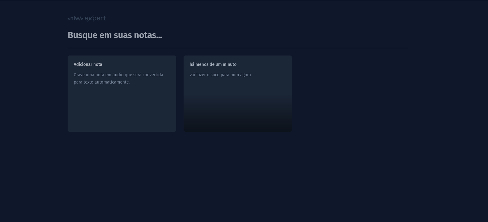

# NLW Expert (React)

Essa aplicação foi desenvolvida durante o NLW Experts da Rocketseat utilizando React, TypeScript, Tailwind e a SpeechRecognition API.

## Ferramentas
- TailwindCSS: Framework CSS para design rápido e responsivo.

- SpeechRecognition API: API de reconhecimento de voz para converter fala em texto.

- Vite: Ferramenta de construção que visa um desenvolvimento mais rápido e uma menor configuração.

- @radix-ui/react-dialog: Biblioteca para criação de diálogos acessíveis e personalizáveis.

- date-fns: Biblioteca para manipulação de datas.

- toast (sonner): Biblioteca para feedback visual através de notificações leves.

## Arquitetura e Padrões
O projeto segue uma arquitetura modular e componentizada, facilitando a manutenção e a escalabilidade. Os componentes são organizados por funcionalidade dentro da pasta src/components, e a lógica de estado é gerenciada usando hooks do React. A aplicação também adota o padrão de design **Composição de Componentes**, permitindo a reutilização e a personalização de componentes de forma eficiente.

## Executando

Após clonar o repositório, acesse a pasta do projeto e execute os comandos abaixo:

```sh
pnpm install
pnpm dev
```

Acesse http://localhost:5173 para visualizar a aplicação.

## Créditos
- Desenvolvido durante o NLW Experts da Rocketseat.
- Utiliza ícones de [lucide-icons](https://lucide.dev/).